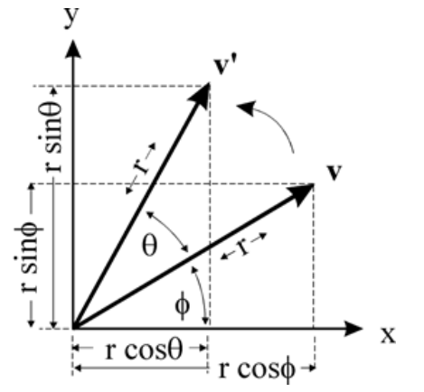

# 人体动作的表示以及动作捕捉数据文件处理
## 动作的表示  
三维空间中的刚体运动的描述方式为：位移+旋转。而由于是刚体不只是一个点，所以除了运动之外还需要描述它的姿态，也即朝向。因此通常的做法是设定一个不变的世界坐标系，
在刚体(或者关节点)上设一个移动的局部坐标系，以方便描述运动轨迹以及刚体朝向。  
### 运动的描述  
运动的描述方式有四种：旋转矩阵，变换矩阵，欧拉角，四元数。  
#### 旋转矩阵  
##### 2D空间  
如下图所示，点v绕原点旋转$\theta$到达v'的位置。  

##### 3D空间  
#### 变换矩阵
#### 欧拉角
#### 四元数


## BVH file
BVH是BioVision等设备对人体运动进行捕获后产生的文件格式，其中包含角色的骨骼和肢体关节旋转数据。
### 格式
分成Hierarchy和Motion两个部分。  
#### Hierarchy  
这个部分包含了骨架信息，记录了人体的各个关节点是如何连接的。通常以骨盆节点为根，根据各个关节点的连接关系形成树状层次化结构。如下方例子所示，Hips为根节点，Chest、LeftUpLeg等等为其子节点。根节点以**ROOT**标记，其他节点以**JOINT**标记，**End Site**表示递归结束。    
在每个节点中，都记录了OFFSET, CHANNELS等信息，其含义如下：  
- **OFFSET**：节点相对于父节点的偏移量，三个分量分别为X,Y,Z，根据这些offset信息可以画出来起始状态下(也称为T pose)的人体骨架。  
- **CHANNELS**：这个信息为关节点的位移和旋转分量在motion帧向量中的顺序，在bvh文件中用欧拉角来表示关节的旋转。Channels的顺序与后续motion中每一帧向量中维度的顺序是对应的，如下面例子，每一帧的前六个维度就是ROOT的位移(x,y,z三个分量)信息和旋转(绕z,x,y轴)信息，接着第七八九个维度是子关节Chest的三个轴旋转分量，以此类推。  
- **坐标系**：每个关节都有自己的局部坐标系，CHANNELS也是相对于其局部坐标系而言。在T pose中，所有坐标系的朝向一致，ROOT的坐标系与世界坐标系重合，其他关节点OFFSET表示该关节局部坐标系相对于父节点局部坐标系的位移，朝向与世界坐标系也是一致的。    
```
	HIERARCHY
	ROOT Hips
	{
		OFFSET  0.00    0.00    0.00
		CHANNELS 6 Xposition Yposition Zposition Zrotation Xrotation Yrotation
		JOINT Chest
		{
			OFFSET   0.00    5.21    0.00'
			CHANNELS 3 Zrotation Xrotation Yrotation
			JOINT Neck
			{
				OFFSET   0.00    18.65   0.00
				CHANNELS 3 Zrotation Xrotation Yrotation
				JOINT Head
				{
					OFFSET   0.00    5.45    0.00
					CHANNELS 3 Zrotation Xrotation Yrotation
					End Site 
					{
						OFFSET   0.00    3.87    0.00
					}
				}
			}
			JOINT LeftCollar
			{
				OFFSET   1.12    16.23   1.87
				CHANNELS 3 Zrotation Xrotation Yrotation
				JOINT LeftUpArm
				{
					OFFSET   5.54    0.00    0.00
					CHANNELS 3 Zrotation Xrotation Yrotation
					JOINT LeftLowArm
					{
						OFFSET   0.00   -11.96   0.00
						CHANNELS 3 Zrotation Xrotation Yrotation
						JOINT LeftHand
						{
							OFFSET   0.00   -9.93    0.00
							CHANNELS 3 Zrotation Xrotation Yrotation
							End Site 
							{
								OFFSET   0.00   -7.00    0.00
							}
						}
					}
				}
			}
			JOINT RightCollar
			{
				OFFSET  -1.12    16.23   1.87
				CHANNELS 3 Zrotation Xrotation Yrotation
				JOINT RightUpArm
				{
					OFFSET  -6.07    0.00    0.00
					CHANNELS 3 Zrotation Xrotation Yrotation
					JOINT RightLowArm
					{
						OFFSET   0.00   -11.82   0.00
						CHANNELS 3 Zrotation Xrotation Yrotation
						JOINT RightHand
						{
							OFFSET   0.00   -10.65   0.00
							CHANNELS 3 Zrotation Xrotation Yrotation
							End Site 
							{
								OFFSET   0.00   -7.00    0.00
							}
						}
					}
				}
			}
		}
		JOINT LeftUpLeg
		{
			OFFSET   3.91    0.00    0.00
			CHANNELS 3 Zrotation Xrotation Yrotation
			JOINT LeftLowLeg
			{
				OFFSET   0.00   -18.34   0.00
				CHANNELS 3 Zrotation Xrotation Yrotation
				JOINT LeftFoot
				{
					OFFSET   0.00   -17.37   0.00
					CHANNELS 3 Zrotation Xrotation Yrotation
					End Site 
					{
						OFFSET   0.00   -3.46    0.00
					}
				}
			}
		}
		JOINT RightUpLeg
		{
			OFFSET  -3.91    0.00    0.00
			CHANNELS 3 Zrotation Xrotation Yrotation
			JOINT RightLowLeg
			{
				OFFSET   0.00   -17.63   0.00
				CHANNELS 3 Zrotation Xrotation Yrotation
				JOINT RightFoot
				{
					OFFSET   0.00   -17.14   0.00
					CHANNELS 3 Zrotation Xrotation Yrotation
					End Site 
					{
						OFFSET   0.00   -3.75    0.00
					}
				}
			}
		}
	}
```

#### Motion  
Hierarchy结束后，下一行以**Motion**开头，表示motion段开始。Motion段记录了人体运动，每一行数据都是一帧，也就是一个pose。  
- **Frames**: 表示这段动作一共有多少帧  
- **Frame Time**: 动作采样频率  
- **数据部分**: 接下来每一行就是一帧的数据。以下面数据段为例，根据上面的Hierarchy部分的信息，可以得知这个骨架一共有18个关节，ROOT关节有6个分量(位移X,Y,Z和旋转Z,X,Y)，其余关节有3个旋转分量，因此每一帧数据都是一个6+17\*3=57维的向量，每一维代表的信息与上述CHANNELS信息对应。  
- **每一帧计算**
	* 位移：ROOT的位移是hierarchy部分中ROOT节点的OFFSET和每一帧数据前三维定义的平移量(也即该帧的根关节坐标系原点相对于T pose根关节坐标系原点的平移量)之和。而其他子关节点则可以由ROOT的位置和OFFSET计算得到。  
	* 旋转：根据位移和旋转确定ROOT的新位置后，从ROOT开始根据OFFSET和三个旋转分量值递归计算每一层子节点的位置，具体过程为确定了每个父节点的位置后，根据OFFSET计算出子节点的位置，然后再计算旋转后的位置。  
```
MOTION
Frames：    2
Frame Time： 0.033333
 8.03    35.01   88.36  -3.41    14.78  -164.35  13.09   40.30  -24.60   7.88    43.80   0.00   -3.61   -41.45   5.82    10.08   0.00    10.21   97.95  -23.53  -2.14   -101.86 -80.77  -98.91   0.69    0.03    0.00   -14.04   0.00   -10.50  -85.52  -13.72  -102.93  61.91  -61.18   65.18  -1.57    0.69    0.02    15.00   22.78  -5.92    14.93   49.99   6.60    0.00   -1.14    0.00   -16.58  -10.51  -3.11    15.38   52.66  -21.80   0.00   -23.95   0.00   
 7.81    35.10   86.47  -3.78    12.94  -166.97  12.64   42.57  -22.34   7.67    43.61   0.00   -4.23   -41.41   4.89    19.10   0.00    4.16    93.12  -9.69   -9.43    132.67 -81.86   136.80  0.70    0.37    0.00   -8.62    0.00   -21.82  -87.31  -27.57  -100.09  56.17  -61.56   58.72  -1.63    0.95    0.03    13.16   15.44  -3.56    7.97    59.29   4.97    0.00    1.64    0.00   -17.18  -10.02  -3.08    13.56   53.38  -18.07   0.00   -25.93   0.00   
```

### 代码实现  
